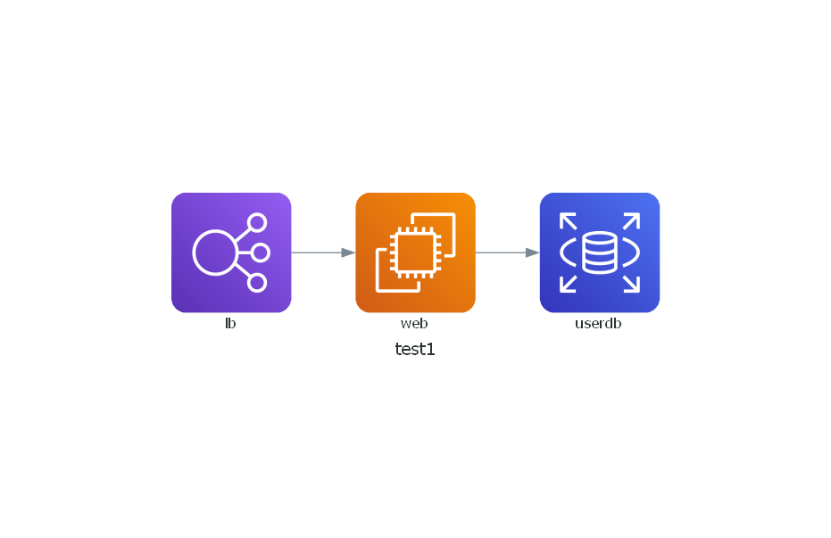
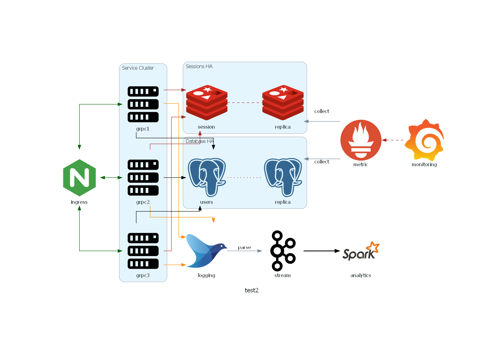

# requirement

```cmd
$ pip install diagrams
```

# a simple diagram



# a more advance one



# the diagrams documentation
[diagrams documentation](https://diagrams.mingrammer.com/docs/getting-started/installation)